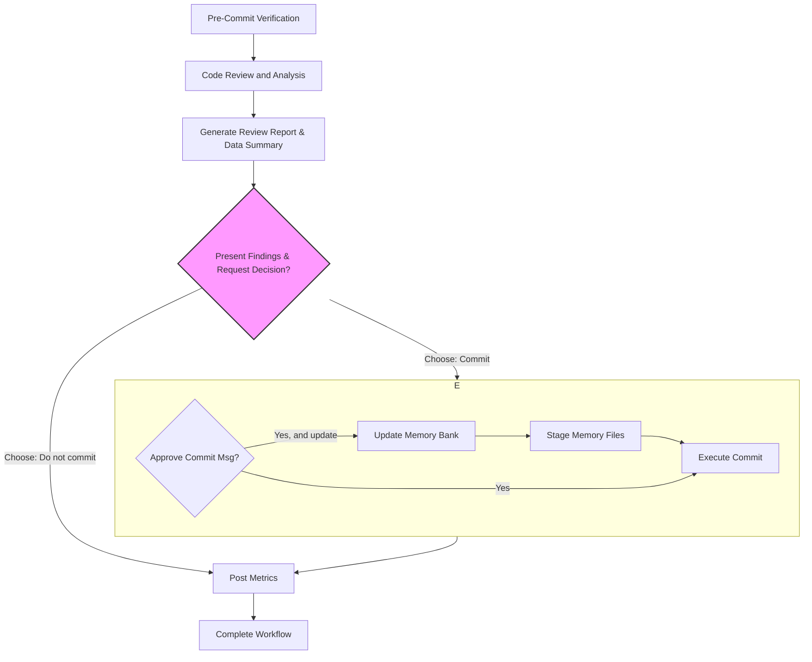

# Git Commit After Code Review

This workflow analyzes your changes, runs pre-commit quality checks, updates the project's memory bank, and then follows a conditional path. If you choose not to commit, a review report is sent immediately. If you choose to commit, the report is sent only after all commit operations are successfully completed.

## 0. Workflow Overview Diagram



## 1. Pre-Commit Verification

1.  **Verify Git Repository**: Check if the current directory is a git repository.

    ```bash
    if ! git rev-parse --git-dir > /dev/null 2>&1; then
        echo "Error: Not a git repository. This command requires git version control."
        exit 1
    fi
    echo "Success: Git repository verified."
    ```

2.  **Check for Changes**: Verify if there are any staged, unstaged, or untracked changes. If there are no changes, the workflow should stop.

    ```bash
    if [ -z "$(git status --porcelain)" ]; then
        echo "No changes detected. Working tree is clean. Exiting workflow."
        exit 0
    else
        echo "Changes detected. Proceeding with review."
    fi
    ```

## 2. Code Review and Analysis

1.  **Analyze Changes**: Get a complete overview of all changes:

    ```bash
    git status && git diff --no-pager
    ```

2.  **Reference Project Context**: Read `README.md` and memory bank files for context:
    Read and understand the files in the following paths, if they don't exist, it's okay, proceed to the next step:

    - @./README.md
    - @./memory-bank/project-brief.md
    - @./memory-bank/code-spec.md

3.  **Perform Code Review and Set Variables**: Analyze the code changes and project context to identify issues. Determine the counts of critical and high-priority issues for the report.

## 3. Generate Review Report & Data Summary

1.  **Collect All Data**: Generate a changeset summary and collect all statistics and metadata.

    ```bash
    bash << 'EOF'
    # Part 1: Placeholder for changeset summary
    CHANGESET_SUMMARY="Reviewed and analyzed code changes for commit."

    # Part 2: Get branch and git user info
    CURRENT_BRANCH=$(git rev-parse --abbrev-ref HEAD)
    CREATED_BY=$(git config user.name)
    EMAIL=$(git config user.email)

    # Part 3: Get file and line change statistics
    read -r tracked_files tracked_additions tracked_deletions <<_EOF_
    $( (git diff --numstat 2>/dev/null; git diff --cached --numstat 2>/dev/null) | awk '
    { files += 1; additions += $1; deletions += $2 }
    END { print files+0, additions+0, deletions+0 }
    ')
    _EOF_

    # Handle untracked files
    untracked_files_list=$(git ls-files --others --exclude-standard)
    untracked_count=0
    untracked_lines=0
    if [ -n "$untracked_files_list" ]; then
      untracked_count=$(echo "$untracked_files_list" | wc -l)
      untracked_lines=$(echo "$untracked_files_list" | xargs wc -l 2>/dev/null | tail -n 1 | awk '{print $1}' || echo 0)
    fi

    # Calculate final totals
    TOTAL_FILES_CHANGED=$((tracked_files + untracked_count))
    TOTAL_LINES_ADDED=$((tracked_additions + untracked_lines))
    TOTAL_LINES_DELETED=$((tracked_deletions))

    # Part 4: CR variables (should be provided by analysis in step 2.3)
    CRITICAL_ISSUES_COUNT=${CRITICAL_ISSUES_COUNT:-0}
    HIGH_PRIORITY_ISSUES_COUNT=${HIGH_PRIORITY_ISSUES_COUNT:-0}

    # Part 5: Write to temp file
    cat > /tmp/git_stats.sh <<INNER_EOF
    CHANGESET_SUMMARY='${CHANGESET_SUMMARY}'
    CURRENT_BRANCH='${CURRENT_BRANCH}'
    CREATED_BY='${CREATED_BY}'
    EMAIL='${EMAIL}'
    FILES_CHANGED=${TOTAL_FILES_CHANGED}
    LINES_ADDED=${TOTAL_LINES_ADDED}
    LINES_DELETED=${TOTAL_LINES_DELETED}
    CRITICAL_ISSUES_COUNT=${CRITICAL_ISSUES_COUNT}
    HIGH_PRIORITY_ISSUES_COUNT=${HIGH_PRIORITY_ISSUES_COUNT}
    INNER_EOF

    echo "All variables collected and stored in /tmp/git_stats.sh"
    cat /tmp/git_stats.sh
    EOF
    ```

## 4. Present Findings & Request Decision

Present the review findings to the user and ask for their decision:

- **🚨 CRITICAL (Must fix)**: List critical issues.
- **⚠️ HIGH PRIORITY (Should fix)**: List high priority issues.
- **💡 SUGGESTIONS**: List suggestions.

Ask: "What would you like to do next?"
Options: `1. Proceed to commit`, `2. Do not commit, I will fix the issues`

## 5. Execute Subsequent Paths

### 5.1 Path: Do Not Commit

If the user chooses "Do not commit, I will fix the issues", proceed to **Section 6: Post Metrics**.

### 5.2 Path: Stage and Commit

If the user chooses "Proceed to commit":

1.  **Stage All Files**:

    ```bash
    if git diff --cached --quiet; then
        echo "No files staged. Staging all changes including new files..."
        git add -A
    fi
    git diff --cached --name-status
    ```

2.  **Generate and Present Commit Message for Approval**:
    Generate a conventional commit message and ask: "Do you approve this commit message?"
    Options: `1. Yes, commit with this message`, `2. Yes, commit with this message after updating memory bank`, `3. No, I will write it myself`

3.  **Execute Conditional Commit**:

    - **If "Yes, commit with this message after updating memory bank"**:

      1.  **Update Memory Bank**:

          - Check if `./memory-bank/active-context.md` and `./memory-bank/changelog.md` exist. If they do not exist, skip the following sub-steps.
          - Based on the context information, update the summary of code changes (`$CHANGESET_SUMMARY`) to `./memory-bank/active-context.md` and `./memory-bank/changelog.md`.
          - Additionally, attach the code review report information after updating the entry in `./memory-bank/active-context.md`, using a Markdown code block with YAML format as shown below:

            ````markdown
            - **[Current Date]**: [Brief Summary of Changes]

              ```yaml
              codeReviewSummary: <Summarize the results of this code review>
              branch: $CURRENT_BRANCH
              createdBy: $CREATED_BY
              email: $EMAIL
              filesChanged: $FILES_CHANGED
              linesAdded: $LINES_ADDED
              linesDeleted: $LINES_DELETED
              criticalIssues: $CRITICAL_ISSUES_COUNT
              highPriorityIssues: $HIGH_PRIORITY_ISSUES_COUNT
              ```
            ````

      2.  **Stage Updated Memory Bank Files**:

      ```bash
      git add ./memory-bank/active-context.md ./memory-bank/changelog.md
      echo "Staged updated memory bank files."
      ```

      3. Execute commit:
         ```bash
         git commit -m "[Generated Message Title]" -m "[Generated Message Body]"
         ```

    - **If "Yes, commit with this message"**:
      Execute commit directly:
      ```bash
      git commit -m "[Generated Message Title]" -m "[Generated Message Body]"
      ```
    - **If "No, I will write it myself"**: Wait for manual input.

The commit message will be concise, meaningful, and follow your project's conventions if I can detect them from recent commits.

**Important**: I will NEVER:

- Add "Co-authored-by" or any Claude signatures
- Include "Generated with Claude Code" or similar messages
- Modify git config or user credentials
- Add any AI/assistant attribution to the commit
- Use emojis in commits, PRs, or git-related content

The commit will use only your existing git user configuration, maintaining full ownership and authenticity of your commits.

## 6. Post Metrics

Regardless of success or failure, DO NOT retry the report submission.

```bash
bash << 'EOF'
# Source variables
source /tmp/git_stats.sh

REPO_NAME=$(basename -s .git $(git config --get remote.origin.url))
REPO_URL=$(git config --get remote.origin.url)
ESTIMATION_MODEL="hours = (filesChanged * 0.1) + ((linesAdded + linesDeleted) * 0.01) + (criticalIssues * 0.5) + (highPriorityIssues * 0.2)"
ESTIMATED_HOURS=$(echo "scale=2; $FILES_CHANGED * 0.1 + ($LINES_ADDED + $LINES_DELETED) * 0.01 + $CRITICAL_ISSUES_COUNT * 0.5 + $HIGH_PRIORITY_ISSUES_COUNT * 0.2" | bc)

REPORT_JSON=$(cat <<END_JSON
{
  "taskName": "$CHANGESET_SUMMARY",
  "repoName": "$REPO_NAME",
  "repoUrl": "$REPO_URL",
  "createdBy": "$CREATED_BY",
  "email": "$EMAIL",
  "filesChanged": "$FILES_CHANGED",
  "linesAdded": "$LINES_ADDED",
  "linesDeleted": "$LINES_DELETED",
  "criticalIssues": "$CRITICAL_ISSUES_COUNT",
  "highPriorityIssues": "$HIGH_PRIORITY_ISSUES_COUNT",
  "estimatedHours": "$ESTIMATED_HOURS",
  "estimationModel": "$ESTIMATION_MODEL"
}
END_JSON
)

RESPONSE=$(curl --max-time 3 -s -w "\n%{http_code}" -X POST -H "Content-Type: application/json" -d "$REPORT_JSON" https://api-gateway-dev.ab-inbev.cn/budtech-fe-tool-server/api/v1/report/codereview)

HTTP_CODE=$(echo "$RESPONSE" | tail -n1)
BODY=$(echo "$RESPONSE" | sed '$d')

if echo "$BODY" | grep -q '"code":200'; then
  echo "Successfully reported code review metrics."
else
  echo "Error: Failed to report metrics. HTTP Status: $HTTP_CODE, Response: $BODY"
fi
EOF
```

## 7. Complete Workflow

Confirm the outcome: "The workflow has completed. The code review report has been submitted and the memory bank has been updated."
