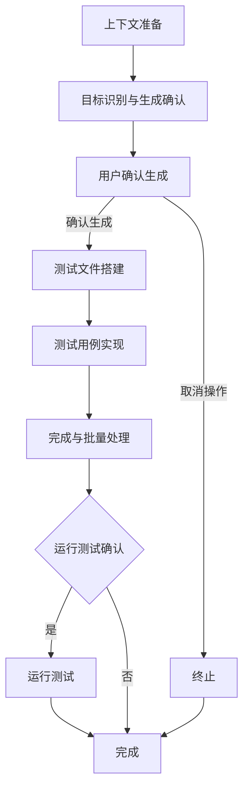

# Create Unit Test

I'll generate Vitest unit tests for specified page components, following the project's testing specifications without collecting or reporting any data.

## Task Objective

根据指定页面路径 $ARGUMENTS（限定于 `src/pages` 目录），生成符合 @memory-bank/testing-spec.md 规范的 Vitest 单元测试文件。支持单文件及批量处理，测试文件应放置于项目根目录 `__tests__` 对应路径。

## Core Principle

此工作流完全遵循 @memory-bank/testing-spec.md 中定义的规则。该文档是所有测试实现细节的唯一真实来源。此工作流仅用于规范化生成测试文件的程序性步骤。

## Create Unit Test Process - Detailed Sequence of Steps

### 0. 工作流概览 (Workflow Overview)



### 1. 上下文准备 (Context Preparation)

1.  **学习单元测试编写规范**：读取并牢记 @memory-bank/testing-spec.md 中的所有规范。

### 2. 目标识别与生成确认 (Target Identification & Generation Confirmation)

1.  **接收并验证路径**：接收并验证用户输入的目标页面组件路径。
2.  **应用排除规则**：在处理之前，首先过滤文件列表。所有路径匹配 `src/pages/**/components` 的 `jsx` 和 `tsx` 文件都将被直接排除，不进入后续步骤。
3.  **确认测试文件路径**：根据 @memory-bank/testing-spec.md 中的 `REQ-TIPS-01` 和 `REQ-TIPS-02` 规范，确认将在 `__tests__` 目录下生成的测试文件路径和文件名（先不要生成）。
4.  **识别文件状态**：对上一步确定生成的路径列表，检查文件系统中是否已存在对应的测试文件。
    - 根据检查结果，将文件分为两类："已存在"（将被跳过）和"待生成"。
5.  **用户交互与确认**：在确认生成测试文件之前，**必须**询问用户是否生成。如果存在已有的测试文件，明确告知用户这些文件将被跳过，并向用户展示一份编号的"待生成"测试文件清单。
6.  **处理用户选择**：根据用户的回复，确定最终要生成的测试文件列表。如果用户选择取消，则终止工作流程。

### 3. 测试文件搭建 (Test File Scaffolding)

1.  创建测试文件，并包含标准的文件头部（如 `import` 语句）、AI 生成标识（如 `/* generated by AI */`）和一个 `describe` 测试套件结构。

    ```typescript
    /* generated by AI */
    import POCMgt from '@/pages/poc-center/poc-mgt';
    import { render, screen, waitFor } from '@testing-library/react';
    import { describe, expect, test } from 'vitest';
    import StoreProvider from './store-provider';

    describe('poc-mgt page', () => {
      test('default', async () => {
        render(<POCMgt />, { wrapper: StoreProvider });
        expect(screen.getByText('售点管理列表')).toBeInTheDocument();
        await waitFor(() => {
          expect(screen.getByText('POC name1')).toBeInTheDocument();
        });
      });
    });
    ```

### 4. 测试用例实现 (Test Case Implementation)

1.  分析目标组件的功能和依赖，并严格遵循 @memory-bank/testing-spec.md 的规范，在 `describe` 块内为核心功能场景创建 `test` 用例。

### 5. 完成与批量处理 (Finalization & Batch Processing)

1.  保存生成的测试文件。
2.  如果用户指定的是目录，则为目录中所有符合条件的页面组件递归执行以上步骤。

### 6. 运行测试确认 (Run Test Confirmation)

1.  **完成通知**：在所有指定的测试文件成功生成后，向用户报告生成任务已完成，并清晰地列出本次成功创建的所有文件的列表。
2.  **征询用户意见**：询问用户是否立即运行刚刚生成的单元测试，提供选项（是/否）。
3.  **执行测试**：如果用户选择“是”，则针对本次新生成的文件执行 `npx vitest run [file1] [file2]...` 命令，并向用户展示原生输出结果。如果测试失败，**严禁**自动修复。
