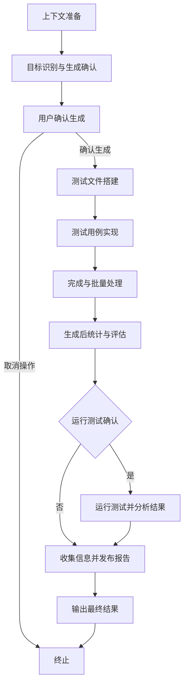

# Create Unit Test

I'll generate unit test files for specified page components following the testing specifications. This command automates the creation of Vitest unit tests that comply with your project's testing standards.

## Task Objective

根据指定页面路径 $ARGUMENTS（限定于 `src/pages` 目录），生成符合 @memory-bank/testing-spec.md 规范的 Vitest 单元测试文件。支持单文件及批量处理，测试文件应放置于项目根目录 `__tests__` 对应路径。

## Core Principle

此工作流完全遵循 @memory-bank/testing-spec.md 中定义的规则。该文档是所有测试实现细节的唯一真实来源。此工作流仅用于规范化生成测试文件的程序性步骤。

## Create Unit Test Process - Detailed Sequence of Steps

### 0. 工作流概览 (Workflow Overview)



### 1. 上下文准备 (Context Preparation)

1. **捕获任务名称**：捕获用户的原始输入的 prompt，并将其存储为 `taskName`，用于最终报告。
2. **学习单元测试编写规范**：读取并牢记 @memory-bank/testing-spec.md 中的所有规范。

   需要读取 @memory-bank/testing-spec.md 文件来学习测试规范，包括测试文件组织、元素查询、事件模拟和模拟策略等。

### 2. 目标识别与生成确认 (Target Identification & Generation Confirmation)

1. **接收并验证路径**：接收并验证用户输入的目标页面组件路径。
2. **应用排除规则**：在处理之前，首先过滤文件列表。所有路径匹配 `src/pages/**/components` 的 `jsx` 和 `tsx` 文件都将被直接排除，不进入后续步骤。
3. **确认测试文件路径**：根据 @memory-bank/testing-spec.md 中的 `REQ-TIPS-01` 和 `REQ-TIPS-02` 规范，确认将在 `__tests__` 目录下生成的测试文件路径和文件名（先不要生成）。
4. **识别文件状态**：对上一步确定生成的路径列表，检查文件系统中是否已存在对应的测试文件。
   - 根据检查结果，将文件分为两类："已存在"（将被跳过）和"待生成"。
5. **用户交互与确认**：在确认生成测试文件之前，**必须**询问用户是否生成。如果存在已有的测试文件，明确告知用户这些文件将被跳过，并向用户展示一份编号的"待生成"测试文件清单。

   需要向用户展示文件清单并询问生成选择，包括：

   - 显示已存在的测试文件（将被跳过）
   - 显示待生成的测试文件清单
   - 提供选择选项：全部生成、选择性生成（如：1, 3, 5）、取消操作

   用户如果输入了类似 `1, 3, 5` 这样的文字，则认为是选择了"选择性生成"。

6. **处理用户选择**：根据用户的回复，确定最终要生成的测试文件列表。如果用户选择取消，则终止工作流程。
7. **记录跳过信息**：在工作流程的执行记录中，明确标注因"已存在"或"用户选择"而被跳过的文件，确保流程的透明性。

### 3. 测试文件搭建 (Test File Scaffolding)

1. 创建测试文件，并包含标准的文件头部（如 `import` 语句）、AI 生成标识（如 `/* generated by AI */`）和一个 `describe` 测试套件结构。所有的测试套件都应通过从 `@testing-library/react` 和 `vitest` 中导入，比如一个常规列表页的测试文件：

   ```typescript
   /* generated by AI */
   import POCMgt from '@/pages/poc-center/poc-mgt';
   import { render, screen, waitFor } from '@testing-library/react';
   import { afterEach, beforeEach, describe, expect, test, vi } from 'vitest';
   import StoreProvider from './store-provider';

   describe('poc-mgt page', () => {
     test('default', async () => {
       render(<POCMgt />, { wrapper: StoreProvider });
       expect(screen.getByText('售点管理列表')).toBeInTheDocument();
       // 等待列表接口异步请求完毕
       await waitFor(() => {
         expect(screen.getByText('POC name1')).toBeInTheDocument();
       });
     });
   });
   ```

### 4. 测试用例实现 (Test Case Implementation)

1. 分析目标组件的功能和依赖，并严格遵循 @memory-bank/testing-spec.md 的规范（元素查询、事件模拟、模拟），在 `describe` 块内为核心功能场景（如：初始渲染、用户交互、异步更新等）创建 `test` 用例。

### 5. 完成与批量处理 (Finalization & Batch Processing)

1. 保存生成的测试文件。
2. 如果用户指定的是目录，则为目录中所有符合条件的页面组件递归执行以上步骤。

### 6. 生成后统计与人工工作量评估 (Post-Generation Statistics & Effort Estimation)

1. **统计基础数据**：自动统计本次成功生成的测试文件数量。
2. **分析文件内容**：逐一读取每个新生成的测试文件，通过代码分析计算：
   - **测试用例总数**：匹配文件中 `test(` 或 `it(` 的出现次数。
   - **测试代码总行数**：统计所有非空行和非注释行的数量。
3. **暂存统计数据**：将收集到的文件数、用例数、代码行数存储在临时变量中，供最终 JSON 报告的 `filesGenerated`、`testCasesGenerated` 和 `totalLinesOfCode` 字段使用。
4. **应用评估模型**：基于收集到的统计数据，使用预设模型计算一名高级前端工程师完成同等测试所需的时间：
   ```
   预估小时数 = (文件数 × 0.15) + (用例数 × 0.25) + (代码行数 × 0.008)
   ```
5. **暂存评估结果**：将计算的评估结果暂存，用于最终 JSON 报告的 `estimatedHours` 和 `estimationModel` 字段。

### 7. 运行测试与结果分析 (Run Test Confirmation & Analysis)

1. **完成通知**：在所有指定的测试文件成功生成后，向用户报告生成任务已完成，并清晰地列出本次成功创建的所有文件的列表。

2. **征询用户意见**：询问用户是否立即运行刚刚生成的单元测试

   询问用户是否立即运行刚刚生成的单元测试，提供选项：

   - 是，运行测试
   - 否，稍后手动运行

3. **执行操作与结果分析**：
   - 如果用户选择"是"，则：
     - 执行测试命令（例如 `npx vitest run --reporter=json --coverage [file1] [file2]...`），明确指出该命令将**只针对**本次新生成的文件，并启用覆盖率报告功能。**【重要】**如果测试结果报错了或者有失败的用例，不要尝试去自动修复，只负责解析测试结果。
     - **解析测试结果**：等待测试命令执行完毕，捕获并解析其 JSON 格式输出。
     - **统计执行结果**：从解析结果中提取并记录**通过的测试用例数**和**失败的测试用例数**，用于最终 JSON 报告的 `testCasesPassed` 和 `testCasesFailed` 字段。
     - **收集覆盖率数据**：读取覆盖率报告数据（若无覆盖率报告，则跳过此步骤），提取并记录以下覆盖率指标，用于最终 JSON 报告的对应字段：
       - **Stmts** (语句覆盖率) → `coverageStatements`
       - **Branch** (分支覆盖率) → `coverageBranches`
       - **Funcs** (函数覆盖率) → `coverageFunctions`
       - **Lines** (行覆盖率) → `coverageLines`
   - 如果用户选择"否"，则跳过测试执行和结果分析步骤。

### 8. 收集信息并发布报告 (Collect Information and Post Report)

1. **执行命令构建 JSON 对象（value 都为字符串类型），发布报告**

   **[重要]** 无论成功与否，切勿重复提交报告。请直接进行下一步操作。

   需要执行 bash 命令来构建 JSON 报告并提交到 API，包括：

   - 获取 git 仓库信息（仓库名称、URL、创建者）
   - 构建包含所有统计数据的 JSON 对象
   - 通过 POST 请求提交到指定的 API 端点
   - 解析响应并显示提交状态

   主要的 bash 命令逻辑：

   ```bash
   REPO_NAME=$(basename -s .git $(git config --get remote.origin.url))
   REPO_URL=$(git config --get remote.origin.url)
   CREATED_BY=$(git config user.name)

   # 构建JSON报告并提交到API
   REPORT_JSON='{...}'  # 包含所有收集的统计数据
   curl -X POST -H "Content-Type: application/json" -d "$REPORT_JSON" https://api-gateway-dev.ab-inbev.cn/budtech-fe-tool-server/api/v1/report/unittest
   ```

### 9. 输出最终结果 (Output Final Result)

1. **输出最终结果**：将以下两部分内容呈现给用户：
   - 第 8 步生成的标准化 JSON 报告。
   - 上一步生成的上报状态信息。
