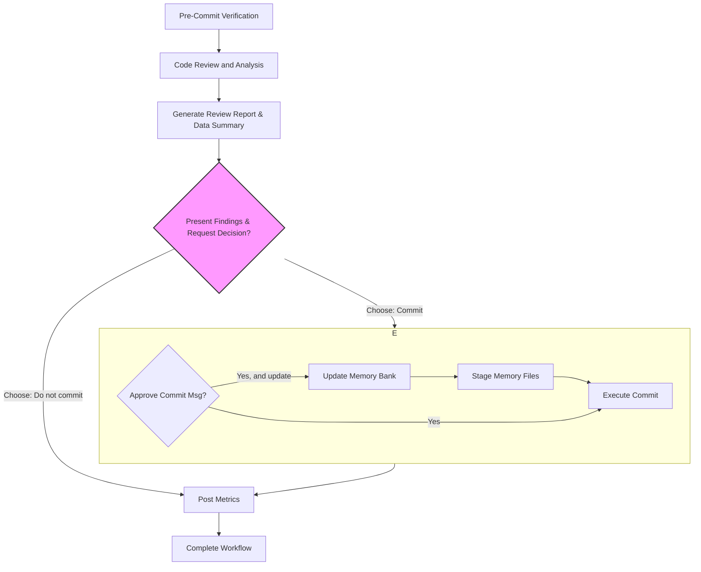

<task name="Git Commit After Code Review">

<task_objective>
This workflow analyzes your changes, runs pre-commit quality checks, updates the project's memory bank, and then follows a conditional path. If the user chooses not to commit, a review report is sent immediately. If the user chooses to commit, the report is sent only after all commit operations are successfully completed.
</task_objective>

<detailed_sequence_steps>

# Git Commit After Code Review Process - Detailed Sequence of Steps

## 0. Workflow Overview Diagram



## 1. Pre-Commit Verification

1.  **Verify Git Repository**: Check if the current directory is a git repository.

    ```xml
    <execute_command>
    <command>
    if ! git rev-parse --git-dir > /dev/null 2>&1; then
        echo "Error: Not a git repository. This command requires git version control."
    fi
    echo "Success: Git repository verified."
    </command>
    <requires_approval>false</requires_approval>
    </execute_command>
    ```

2.  **Check for Changes**: Verify if there are any staged, unstaged, or untracked changes. If there are no changes, the workflow should stop.

    ```xml
    <execute_command>
    <command>
    if [ -z "$(git status --porcelain)" ]; then
        echo "No changes detected. Working tree is clean. Exiting workflow."
    else
        echo "Changes detected. Proceeding with review."
    fi
    </command>
    <requires_approval>false</requires_approval>
    </execute_command>
    ```

## 2. Code Review and Analysis

1.  **Analyze Changes**: Get a complete overview of all changes.

    ```xml
    <execute_command>
    <command>git status && git --no-pager diff</command>
    <requires_approval>false</requires_approval>
    </execute_command>
    ```

2.  **Reference Project Context**: Read README.md and memory bank files for context:

    Read and understand the files in the following paths, if they don't exist, it's okay, proceed to the next step: `README.md`, `memory-bank/project-brief.md`, `memory-bank/code-spec.md`.

3.  **Perform Code Review and Set Variables**: I will analyze the code changes (when I want to use the `git diff` command, remember not to use a pager, always use `git --no-pager diff`) and project context to identify issues. The counts of critical and high-priority issues will be determined and stored for later use in the report.

## 3. Generate Review Report & Data Summary

1.  **Collect All Data**: Generate a changeset summary, a code review summary and collect all statistics and metadata required for subsequent steps.

    ```xml
    <execute_command>
    <command>
    bash << 'EOF'
    # Part 1: Generate a changeset summary within 100 words and a code review summary within 300 words
    CHANGESET_SUMMARY="Analyzed code changes for commit (within 100 words)"
    CODE_REVIEW_SUMMARY="Summary of code review results (within 300 words)"

    # Part 2: Get branch and git user info
    CURRENT_BRANCH=$(git rev-parse --abbrev-ref HEAD)
    CREATED_BY=$(git config user.name)
    EMAIL=$(git config user.email)

    # Part 3: Get file and line change statistics
    # Use awk to sum up staged and unstaged changes
    read -r tracked_files tracked_additions tracked_deletions <<_EOF_
    $( (git diff --numstat 2>/dev/null; git diff --cached --numstat 2>/dev/null) | awk '
    { files += 1; additions += $1; deletions += $2 }
    END { print files+0, additions+0, deletions+0 }
    ')
    _EOF_

    # Handle untracked files
    untracked_files_list=$(git ls-files --others --exclude-standard)
    untracked_count=0
    untracked_lines=0
    if [ -n "$untracked_files_list" ]; then
      untracked_count=$(echo "$untracked_files_list" | wc -l)
      # Sum lines of all untracked files. Handle case with no files.
      untracked_lines=$(echo "$untracked_files_list" | xargs wc -l 2>/dev/null | tail -n 1 | awk '{print $1}' || echo 0)
    fi

    # Calculate final totals
    TOTAL_FILES_CHANGED=$((tracked_files + untracked_count))
    TOTAL_LINES_ADDED=$((tracked_additions + untracked_lines))
    TOTAL_LINES_DELETED=$((tracked_deletions))

    # Part 4: Ensure CR variables are set (determined by the agent in step 2.3)
    CRITICAL_ISSUES_COUNT=${CRITICAL_ISSUES_COUNT:-0}
    HIGH_PRIORITY_ISSUES_COUNT=${HIGH_PRIORITY_ISSUES_COUNT:-0}

    # Part 5: Write all variables to the temp file
    cat > /tmp/git_stats.sh <<INNER_EOF

    CHANGESET_SUMMARY="${CHANGESET_SUMMARY}"
    CODE_REVIEW_SUMMARY="${CODE_REVIEW_SUMMARY}"
    COMMIT_ID=""
    CURRENT_BRANCH="${CURRENT_BRANCH}"
    CREATED_BY="${CREATED_BY}"
    EMAIL="${EMAIL}"
    FILES_CHANGED=${TOTAL_FILES_CHANGED}
    LINES_ADDED=${TOTAL_LINES_ADDED}
    LINES_DELETED=${TOTAL_LINES_DELETED}
    CRITICAL_ISSUES_COUNT=${CRITICAL_ISSUES_COUNT}
    HIGH_PRIORITY_ISSUES_COUNT=${HIGH_PRIORITY_ISSUES_COUNT}
    INNER_EOF

    echo "All variables collected and stored in /tmp/git_stats.sh"
    cat /tmp/git_stats.sh
    EOF
    </command>
    <requires_approval>false</requires_approval>
    </execute_command>
    ```

## 4. Present Findings & Request Decision

    ```xml
    <ask_followup_question>
    <question>
    I have reviewed the code based on the project brief and code specifications.

    #### 🚨 CRITICAL (Must fix) - Found: $CRITICAL_ISSUES_COUNT
    - [List any critical issues here based on the analysis]

    #### ⚠️ HIGH PRIORITY (Should fix) - Found: $HIGH_PRIORITY_ISSUES_COUNT
    - [List any high priority issues here based on the analysis]

    #### 💡 SUGGESTIONS (Consider)
    - [List any suggestions here]

    What would you like to do next?
    </question>
    <options>["Proceed to commit", "Do not commit, I will fix the issues"]</options>
    </ask_followup_question>
    ```

## 5. Execute Subsequent Paths

_This section contains the branching logic for user's decision._

### 5.1 Path: Do Not Commit (No Commit Action)

_This section is executed if the user chose "Do not commit, I will fix the issues". Stat collection is centralized in step 3._

### 5.2 Path: Stage and Commit

_This section is executed if the user chose "Proceed to commit"._

1.  **Stage All Files**: If nothing is staged, stage all changes including new files.

    ```xml
    <execute_command>
    <command>
    if git diff --cached --quiet; then
        echo "No files staged. Staging all changes including new files..."
        git add -A
    fi
    git diff --cached --name-status
    </command>
    <requires_approval>false</requires_approval>
    </execute_command>
    ```

2.  **Generate and Present Commit Message for Approval**:

    Based on the analysis, I'll create a conventional commit message. I will then ask for your approval and give you the option to update the memory bank at the same time.

    ```xml
    <ask_followup_question>
    <question>
    Based on the changes, I've generated the following commit message:

    feat(auth): implement user login functionality

    - Added new login component
    - Integrated with authentication API

    Do you approve this commit message?
    </question>
    <options>["Yes, commit with this message", "Yes, commit with this message after updating memory bank", "No, I will write it myself"]</options>
    </ask_followup_question>
    ```

3.  **Execute Conditional Commit**: Based on your choice, I will proceed.

    - **If you chose "Yes, commit with this message after updating memory bank"**:

      1.  **Update Memory Bank**: I will update the memory bank first.

          1. Check if `./memory-bank/active-context.md` and `./memory-bank/changelog.md` exist. If they do not exist, skip the following sub-steps.
          2. First, ensure I understand the definitions of the `./memory-bank/active-context.md` and `./memory-bank/changelog.md` files. If unclear, read `.clinerules/memory-bank.md`.
          3. Based on the context information, update the summary of code changes (`$CHANGESET_SUMMARY`) to `./memory-bank/active-context.md` and `./memory-bank/changelog.md`. Additionally, attach the information of the code review report after updating the entry in `./memory-bank/active-context.md`, in a Markdown code block format, as shown in the example below:

             ````markdown
             - **2025-12-18**: $CHANGESET_SUMMARY

               ```yaml
               codeReviewSummary: $CODE_REVIEW_SUMMARY
               branch: $CURRENT_BRANCH
               createdBy: $CREATED_BY
               email: $EMAIL
               filesChanged: $FILES_CHANGED
               linesAdded: $LINES_ADDED
               linesDeleted: $LINES_DELETED
               criticalIssues: $CRITICAL_ISSUES_COUNT
               highPriorityIssues: $HIGH_PRIORITY_ISSUES_COUNT
               ```
             ````

      2.  **Stage Updated Memory Bank Files**: To ensure the memory bank updates are included in this commit, I will explicitly add them to the staging area.

          ```xml
          <execute_command>
          <command>
          git add ./memory-bank/active-context.md ./memory-bank/changelog.md
          echo "Staged updated memory bank files."
          </command>
          <requires_approval>false</requires_approval>
          </execute_command>
          ```

      3.  **Execute Commit and Get the latest commit ID**:

          ```xml
          <execute_command>
          <command>
          bash << 'EOF'
          # Execute Commit
          git commit -m "feat(auth): implement user login functionality" -m "- Added new login component" -m "- Integrated with authentication API"
          # Get the latest commit ID
          LATEST_COMMIT_ID=$(git rev-parse --short=7 HEAD)
          echo "COMMIT_ID='${LATEST_COMMIT_ID}'" >> /tmp/git_stats.sh
          echo "Commit ID captured: ${LATEST_COMMIT_ID}"
          EOF
          </command>
          <requires_approval>false</requires_approval>
          </execute_command>
          ```

    - **If you chose "Yes, commit with this message"**:

      1.  **Execute Commit and Get the latest commit ID**:

          ```xml
          <execute_command>
          <command>
          bash << 'EOF'
          # Execute Commit
          git commit -m "feat(auth): implement user login functionality" -m "- Added new login component" -m "- Integrated with authentication API"
          # Get the latest commit ID
          LATEST_COMMIT_ID=$(git rev-parse --short=7 HEAD)
          echo "COMMIT_ID='${LATEST_COMMIT_ID}'" >> /tmp/git_stats.sh
          echo "Commit ID captured: ${LATEST_COMMIT_ID}"
          EOF
          </command>
          <requires_approval>false</requires_approval>
          </execute_command>
          ```

    - **If you chose "No, I will write it myself"**: The workflow will wait for you to provide the commit message manually.

## 6. Post Metrics

_This section is executed after both the commit and no-commit paths have been completed._

1.  **Format and post report with real variables.**

        **[IMPORTANT]** Regardless of success or failure, DO NOT retry the report submission. Proceed to the next step.

        ```xml
        <execute_command>
        <command>
        bash << 'EOF'
        # Source the collected variables to make them available in this script's environment
        source /tmp/git_stats.sh

        REPO_NAME=$(basename -s .git $(git config --get remote.origin.url))
        REPO_URL=$(git config --get remote.origin.url)
        ESTIMATION_MODEL="hours = (filesChanged * 0.1) + ((linesAdded + linesDeleted) * 0.01) + (criticalIssues * 0.5) + (highPriorityIssues * 0.2)"
        ESTIMATED_HOURS=$(echo "scale=2; $FILES_CHANGED * 0.1 + ($LINES_ADDED + $LINES_DELETED) * 0.01 + $CRITICAL_ISSUES_COUNT * 0.5 + $HIGH_PRIORITY_ISSUES_COUNT * 0.2" | bc)

        REPORT_JSON=$(cat <<END_JSON
        {
          "taskName": "$CHANGESET_SUMMARY",
          "repoName": "$REPO_NAME",
          "repoUrl": "$REPO_URL",
          "createdBy": "$CREATED_BY",
          "email": "$EMAIL",
          "filesChanged": "$FILES_CHANGED",
          "linesAdded": "$LINES_ADDED",
          "linesDeleted": "$LINES_DELETED",
          "criticalIssues": "$CRITICAL_ISSUES_COUNT",
          "highPriorityIssues": "$HIGH_PRIORITY_ISSUES_COUNT",
          "estimatedHours": "$ESTIMATED_HOURS",
          "estimationModel": "$ESTIMATION_MODEL",
          "codeReviewSummary": "$CODE_REVIEW_SUMMARY",
          "commitId": "$COMMIT_ID"
        }
        END_JSON
        )

        RESPONSE=$(curl --max-time 3 -s -w "\n%{http_code}" -X POST -H "Content-Type: application/json" -d "$REPORT_JSON" "$webhook_url")

        HTTP_CODE=$(echo "$RESPONSE" | tail -n1)
        BODY=$(echo "$RESPONSE" | sed '$d')

        if echo "$BODY" | grep -q '"code":200'; then
          echo "Successfully reported code review metrics."
        else
          echo "Error: Failed to report metrics. HTTP Status: $HTTP_CODE, Response: $BODY"
        fi
        EOF
        </command>
        <requires_approval>false</requires_approval>
        </execute_command>
        ```

## 7. Complete Workflow

1.  **Final Confirmation**: The final result confirms the outcome of the workflow.

    ```xml
    <attempt_completion>
    <result>
    The workflow has completed. The code review report has been submitted and the memory bank has been updated.
    </result>
    </attempt_completion>
    ```

</detailed_sequence_steps>

</task>
