<task name="Git Commit After Code Review">

<task_objective>
This workflow analyzes your changes, runs pre-commit quality checks, and then follows a conditional path. If the user chooses not to commit, a review report is sent immediately. If the user chooses to commit, the report is sent only after all commit operations are successfully completed.
</task_objective>

<detailed_sequence_steps>

# Git Commit After Code Review Process - Detailed Sequence of Steps

## 0. Workflow Overview

```mermaid
graph TD
    A[开始: Pre-Commit Verification] --> B[Code Review and Analysis];
    B --> C{用户选择: 下一步操作?};
    C -- 选择: 不执行commit --> D[生成并上报审查报告];
    D --> E[工作流结束];
    C -- 选择: 直接执行commit --> F[Stage Modified Files];
    F --> G[生成/确认 Commit Message];
    G --> H[执行 git commit];
    H --> I[生成并上报审查报告];
    I --> J[工作流结束];

    style C fill:#f9f,stroke:#333,stroke-width:2px
    style D fill:#bbf,stroke:#333,stroke-width:1px
    style I fill:#bbf,stroke:#333,stroke-width:1px
```



## 1. Pre-Commit Verification

1.  **Verify Git Repository**: Check if the current directory is a git repository.

    ```xml
    <execute_command>
    <command>
    if ! git rev-parse --git-dir > /dev/null 2>&1; then
        echo "Error: Not a git repository. This command requires git version control."
    fi
    echo "Success: Git repository verified."
    </command>
    <requires_approval>false</requires_approval>
    </execute_command>
    ```

2.  **Check for Changes**: Verify if there are any staged, unstaged, or untracked changes. If there are no changes, the workflow should stop.

    ```xml
    <execute_command>
    <command>
    if [ -z "$(git status --porcelain)" ]; then
        echo "No changes detected. Working tree is clean. Exiting workflow."
    else
        echo "Changes detected. Proceeding with review."
    fi
    </command>
    <requires_approval>false</requires_approval>
    </execute_command>
    ```

## 2. Code Review and Analysis

1.  **Analyze Changes**: Get a complete overview of all changes.

    ```xml
    <execute_command>
    <command>git status && git diff</command>
    <requires_approval>false</requires_approval>
    </execute_command>
    ```

2.  **Reference Project Context**: Read README.md and memory bank files for context.

    Read and understand the files in the following paths, if they don't exist, it's okay, proceed to the next step: `README.md`, `memory-bank/project-brief.md`, `memory-bank/code-spec.md`.

3.  **Perform Automated Review and Set Variables**: I will analyze the code changes and project context to identify issues. The counts of critical and high-priority issues will be determined and stored for later use in the report.

4.  **Present Review Results and Ask for Next Step**: Based on the context and analysis, provide a review summary and ask the user for the next action. The workflow will branch based on the choice.

    ```xml
    <ask_followup_question>
    <question>
    I have reviewed the code based on the project brief and code specifications.

    #### 🚨 CRITICAL (Must fix) - Found: $CRITICAL_ISSUES_COUNT
    - [List any critical issues here based on the analysis]

    #### ⚠️ HIGH PRIORITY (Should fix) - Found: $HIGH_PRIORITY_ISSUES_COUNT
    - [List any high priority issues here based on the analysis]

    #### 💡 SUGGESTIONS (Consider)
    - [List any suggestions here]

    What would you like to do next?
    </question>
    <options>["Proceed to commit", "Do not commit, I will fix the issues"]</options>
    </ask_followup_question>
    ```

## 3. Path: Do Not Commit (Prepare for Report)

_This section is executed only if the user chose "Do not commit, I will fix the issues"._

1.  **Get the number of changed files and lines (include untracked files)**

    ```xml
    <execute_command>
    <command>
    bash << 'EOF'
    quick_git_stats() {
        # 综合统计所有变更
        {
            # 已追踪文件的变更
            git diff --numstat 2>/dev/null
            # 已暂存文件的变更
            git diff --cached --numstat 2>/dev/null
        } | awk '
        {
            if (NF >= 2) {
                additions += $1
                deletions += $2
                files++
            }
        }
        END {
            print "FILES_CHANGED=" files+0
            print "LINES_ADDED=" additions+0
            print "LINES_DELETED=" deletions+0
        }' > /tmp/git_stats.sh

        # 执行临时文件中的变量赋值
        source /tmp/git_stats.sh
        rm -f /tmp/git_stats.sh

        # 单独处理未追踪文件
        untracked_count=$(git ls-files --others --exclude-standard | wc -l)
        untracked_lines=$(git ls-files --others --exclude-standard | xargs wc -l 2>/dev/null | tail -1 | awk '{print $1}' || echo 0)

        # 更新最终统计
        FILES_CHANGED=$((FILES_CHANGED + untracked_count))
        LINES_ADDED=$((LINES_ADDED + untracked_lines))
    }
    quick_git_stats
    EOF
    </command>
    <requires_approval>false</requires_approval>
    </execute_command>
    ```

## 4. Path: Stage and Commit

_This section is executed only if the user chose "Proceed to commit"._

1.  **Stage All Files**: If nothing is staged, stage all changes including new files.

    ```xml
    <execute_command>
    <command>
    if git diff --cached --quiet; then
        echo "No files staged. Staging all changes including new files..."
        git add -A
    fi
    git diff --cached --name-status
    </command>
    <requires_approval>false</requires_approval>
    </execute_command>
    ```

2.  **Generate and Present Commit Message for Approval**:

    Based on the analysis, I'll create a conventional commit message:

    - **Type**: feat|fix|docs|style|refactor|test|chore
    - **Scope**: component or area affected (optional)
    - **Subject**: clear description in present tense
    - **Body**: why the change was made (if needed)

    Example: `git commit -m "fix(auth): resolve login timeout issue"`

    ```xml
    <ask_followup_question>
    <question>
    Based on the changes, I've generated the following commit message:

    ```

    feat(auth): implement user login functionality

    - Added new login component
    - Integrated with authentication API

    ```

    Do you approve this commit message?
    </question>
    <options>["Yes, commit with this message", "No, I will write it myself"]</options>
    </ask_followup_question>
    ```

3.  **Execute Commit**: If approved, run the `git commit` command.

    ```xml
    <execute_command>
    <command>git commit -m "feat(auth): implement user login functionality" -m "- Added new login component" -m "- Integrated with authentication API"</command>
    <requires_approval>false</requires_approval>
    </execute_command>
    ```

4.  **Get the number of files and lines changed in the last commit**

    ```xml
    <execute_command>
    <command>
    bash << 'EOF'
    LAST_COMMIT_STATS=$(git diff-tree --shortstat HEAD~1 HEAD 2>/dev/null)
    FILES_CHANGED=$(echo "$LAST_COMMIT_STATS" | grep -o '[0-9]* files\?' | grep -o '[0-9]*')
    LINES_ADDED=$(echo "$LAST_COMMIT_STATS" | grep -o '[0-9]* insertions\?' | grep -o '[0-9]*')
    LINES_DELETED=$(echo "$LAST_COMMIT_STATS" | grep -o '[0-9]* deletions\?' | grep -o '[0-9]*')
    FILES_CHANGED=${FILES_CHANGED:-0}
    LINES_ADDED=${LINES_ADDED:-0}
    LINES_DELETED=${LINES_DELETED:-0}
    EOF
    </command>
    <requires_approval>false</requires_approval>
    </execute_command>
    ```

## 5. Collect Information and Post Report

_This section is executed after both the commit and no-commit paths have been completed._

1.  **Format and post report with real variables.**

    **[IMPORTANT]** Regardless of success or failure, DO NOT retry the report submission. Proceed to the next step.

    ```xml
    <execute_command>
    <command>
    bash << 'EOF'
    REPO_NAME=$(basename -s .git $(git config --get remote.origin.url))
    REPO_URL=$(git config --get remote.origin.url)
    CREATED_BY=$(git config user.name)
    ESTIMATION_MODEL="hours = (filesChanged * 0.1) + ((linesAdded + linesDeleted) * 0.01) + (criticalIssues * 0.5) + (highPriorityIssues * 0.2)"
    ESTIMATED_HOURS=$(echo "$FILES_CHANGED * 0.1 + ($LINES_ADDED + $LINES_DELETED) * 0.01 + $CRITICAL_ISSUES * 0.5 + $HIGH_PRIORITY_ISSUES * 0.2" | bc)

    REPORT_JSON='{
      "taskName": "AI-Generated Task Name based on diff",
      "repoName": "'"$REPO_NAME"'",
      "repoUrl": "'"$REPO_URL"'",
      "createdBy": "'"$CREATED_BY"'",
      "filesChanged": "'"$FILES_CHANGED"'",
      "linesAdded": "'"$LINES_ADDED"'",
      "linesDeleted": "'"$LINES_DELETED"'",
      "criticalIssues": "'"$CRITICAL_ISSUES"'",
      "highPriorityIssues": "'"$HIGH_PRIORITY_ISSUES"'",
      "estimatedHours": "'"$ESTIMATED_HOURS"'",
      "estimationModel": "'"$ESTIMATION_MODEL"'"
    }'

    RESPONSE=$(curl -s -w "\n%{http_code}" -X POST -H "Content-Type: application/json" -d "$REPORT_JSON" https://api-gateway-dev.ab-inbev.cn/budtech-fe-tool-server/api/v1/report/codereview)

    HTTP_CODE=$(echo "$RESPONSE" | tail -n1)
    BODY=$(echo "$RESPONSE" | sed '$d')

    if echo "$BODY" | grep -q '"code":200'; then
      echo "Successfully reported code review metrics."
    else
      echo "Error: Failed to report metrics. HTTP Status: $HTTP_CODE, Response: $BODY"
    fi
    EOF
    </command>
    <requires_approval>false</requires_approval>
    </execute_command>
    ```

## 6. Complete Workflow

1.  **Final Confirmation**: The final result confirms the outcome of the workflow.

    ```xml
    <attempt_completion>
    <result>
    The workflow has completed. The code review report has been submitted.
    </result>
    </attempt_completion>
    ```

</detailed_sequence_steps>

</task>
