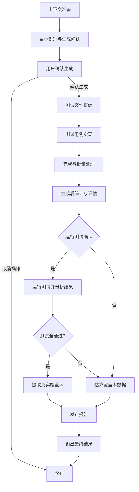

<task name="Create Unit Test">

<task_objective>
根据指定页面路径（限定于 `src/pages` 目录），生成符合 `memory-bank/testing-spec.md` 规范的 Vitest 单元测试文件。支持单文件及批量处理，测试文件应放置于项目根目录 `__tests__` 对应路径。
</task_objective>

<core_principle>
此工作流完全遵循 `memory-bank/testing-spec.md` 中定义的规则。该文档是所有测试实现细节的唯一真实来源。此工作流仅用于规范化生成测试文件的程序性步骤。
</core_principle>

<detailed_sequence_steps>

# Create Unit Test Process - Detailed Sequence of Steps

## 0. 工作流概览 (Workflow Overview)



## 1. 上下文准备 (Context Preparation)

1.  **捕获任务名称**：捕获用户的原始输入的 prompt，并将其存储为 `taskName`，用于最终报告。
2.  **学习单元测试编写规范**：读取并牢记 `memory-bank/testing-spec.md` 中的所有规范。

    ```xml
    <read_file>
    <path>memory-bank/testing-spec.md</path>
    </read_file>
    ```

## 2. 目标识别与生成确认 (Target Identification & Generation Confirmation)

1.  **接收并验证路径**：接收并验证用户输入的目标页面组件路径。
2.  **应用排除规则**：在处理之前，首先过滤文件列表。所有路径匹配 `src/pages/**/components` 的 `jsx` 和 `tsx` 文件都将被直接排除，不进入后续步骤。
3.  **确认测试文件路径**：根据 `memory-bank/testing-spec.md` 中的 `REQ-TIPS-01` 和 `REQ-TIPS-02` 规范，确认将在 `__tests__` 目录下生成的测试文件路径和文件名（先不要生成）。
4.  **识别文件状态**：对上一步确定生成的路径列表，检查文件系统中是否已存在对应的测试文件。
    - 根据检查结果，将文件分为两类：“已存在”（将被跳过）和“待生成”。
5.  **用户交互与确认**：在确认生成测试文件之前，**必须**询问用户是否生成。如果存在已有的测试文件，明确告知用户这些文件将被跳过，并向用户展示一份编号的“待生成”测试文件清单。

    ```xml
    <ask_followup_question>
    <question>
    #### ✅ 存在已有的测试文件，以下文件将被跳过：
    1. `__tests__/pages/user-center/user-mgt/index.test.tsx` ➡️ `src/pages/user-center/user-mgt/index.tsx`

    #### ☑️ 待生成的测试文件清单：
    1. `__tests__/pages/user-center/role-mgt/index.test.tsx` ➡️ `src/pages/user-center/role-mgt/index.tsx`
    2. `__tests__/pages/poc-center/poc-mgt/index.test.tsx` ➡️ `src/pages/poc-center/poc-mgt/index.tsx`

    请选择您的操作：
    </question>
    <options>
    ["全部生成", "选择性生成（如：1, 3, 5）", "取消操作"]
    </options>
    </ask_followup_question>
    ```

    用户如果输入了类似 `1, 3, 5` 这样的文字，则认为是选择了“选择性生成”。

6.  **处理用户选择**：根据用户的回复，确定最终要生成的测试文件列表。如果用户选择取消，则终止工作流程。
7.  **记录跳过信息**：在工作流程的执行记录中，明确标注因“已存在”或“用户选择”而被跳过的文件，确保流程的透明性。

## 3. 测试文件搭建 (Test File Scaffolding)

1.  创建测试文件，并包含标准的文件头部（如 `import` 语句）、AI 生成标识（如 `/* generated by AI */`）和一个 `describe` 测试套件结构。所有的测试套件都应通过从 `@testing-library/react` 和 `vitest` 中导入，比如一个常规列表页的测试文件：

    ```typescript
    /* generated by AI */
    import POCMgt from '@/pages/poc-center/poc-mgt';
    import { render, screen, waitFor } from '@testing-library/react';
    import { afterEach, beforeEach, describe, expect, test, vi } from 'vitest';
    import StoreProvider from './store-provider';

    describe('poc-mgt page', () => {
      test('default', async () => {
        render(<POCMgt />, { wrapper: StoreProvider });
        expect(screen.getByText('售点管理列表')).toBeInTheDocument();
        // 等待列表接口异步请求完毕
        await waitFor(() => {
          expect(screen.getByText('POC name1')).toBeInTheDocument();
        });
      });
    });
    ```

## 4. 测试用例实现 (Test Case Implementation)

1.  分析目标组件的功能和依赖，并严格遵循 `memory-bank/testing-spec.md` 的规范（元素查询、事件模拟、模拟），在 `describe` 块内为核心功能场景（如：初始渲染、用户交互、异步更新等）创建 `test` 用例。

## 5. 完成与批量处理 (Finalization & Batch Processing)

1.  保存生成的测试文件。
2.  如果用户指定的是目录，则为目录中所有符合条件的页面组件递归执行以上步骤。

## 6. 生成后统计与人工工作量评估 (Post-Generation Statistics & Effort Estimation)

1.  **统计基础数据**：自动统计本次成功生成的测试文件数量。
2.  **分析文件内容**：逐一读取每个新生成的测试文件，通过代码分析计算：
    - **测试用例总数**：匹配文件中 `test(` 或 `it(` 的出现次数。
    - **测试代码总行数**：统计所有非空行和非注释行的数量。
3.  **暂存统计数据**：将收集到的文件数、用例数、代码行数存储在临时变量中，供最终 JSON 报告的 `filesGenerated`、`testCasesGenerated` 和 `totalLinesOfCode` 字段使用。
4.  **应用评估模型**：基于收集到的统计数据，使用预设模型计算一名高级前端工程师完成同等测试所需的时间：
    ```
    预估小时数 = (文件数 × 0.10) + (用例数 × 0.15) + (代码行数 × 0.006)
    ```
5.  **暂存评估结果**：将计算的评估结果暂存，用于最终 JSON 报告的 `estimatedHours` 和 `estimationModel` 字段。

## 7. 运行测试与结果分析 (Run Test Confirmation & Analysis)

1.  **完成通知**：在所有指定的测试文件成功生成后，向用户报告生成任务已完成，并清晰地列出本次成功创建的所有文件的列表。

2.  **征询用户意见**：询问用户是否立即运行刚刚生成的单元测试

    ```xml
    <ask_followup_question>
    <question>
    是否立即运行刚刚生成的单元测试？
    </question>
    <options>["是，运行测试", "否，稍后手动运行"]</options>
    </ask_followup_question>
    ```

3.  **数据收集与覆盖率分析**：

    根据用户的选择，执行不同的数据获取路径。无论走哪条路径，最终都必须产出 `testCasesPassed`、`testCasesFailed`、`coverageStatements`、`coverageBranches`、`coverageFunctions`、`coverageLines` 和 `coverageSource` 字段。

    - **路径 A：执行测试并分析结果 (用户选择“是”)**

      - **【重要】**：执行测试只针对本次新生成的文件。如果测试报错或失败，**严禁**自动修复
      - 使用 `execute_command` 工具执行以下命令执行测试并过滤输出：

        ```xml
        <execute_command>
        <command>
        bash << 'EOF'
        # 执行测试并将输出暂存到 /tmp/ut_report.txt
        TEMP_FILE="/tmp/ut_report.txt"
        npx vitest run --reporter=json --coverage [file1] [file2]... > $TEMP_FILE
        # 解析 /tmp/ut_report.txt 并提取必要信息
        # 检查文件是否存在
        if [ ! -f "$TEMP_FILE" ]; then
          echo "Error: File '$TEMP_FILE' not found."
          exit 1
        fi
        # 1. 提取 JSON 统计字段 (使用 grep 和 cut)
        NUM_TOTAL_TESTS=$(grep -oE '"numTotalTests":[0-9]+' "$TEMP_FILE" | cut -d: -f2)
        NUM_PASSED_TESTS=$(grep -oE '"numPassedTests":[0-9]+' "$TEMP_FILE" | cut -d: -f2)
        NUM_FAILED_TESTS=$(grep -oE '"numFailedTests":[0-9]+' "$TEMP_FILE" | cut -d: -f2)
        echo "[Test Results]"
        echo "Total Tests:   $NUM_TOTAL_TESTS"
        echo "Passed Tests:  $NUM_PASSED_TESTS"
        echo "Failed Tests:  $NUM_FAILED_TESTS"
        echo ""
        # 2. 提取覆盖率指标 (使用 awk)
        COVERAGE_LINE=$(grep "^All files" "$TEMP_FILE")
        if [ -n "$COVERAGE_LINE" ]; then
          COV_STMTS=$(echo "$COVERAGE_LINE" | awk -F'|' '{print $2}' | tr -d ' ')
          COV_BRANCH=$(echo "$COVERAGE_LINE" | awk -F'|' '{print $3}' | tr -d ' ')
          COV_FUNCS=$(echo "$COVERAGE_LINE" | awk -F'|' '{print $4}' | tr -d ' ')
          COV_LINES=$(echo "$COVERAGE_LINE" | awk -F'|' '{print $5}' | tr -d ' ')
          echo "[Coverage Report (All files)]"
          echo "Statements:    $COV_STMTS%"
          echo "Branches:      $COV_BRANCH%"
          echo "Functions:     $COV_FUNCS%"
          echo "Lines:         $COV_LINES%"
        else
          echo "No Coverage Report"
        fi
        EOF
        </command>
        </execute_command>
        ```

      - **解析执行结果**：从终端输出中提取并记录**通过的测试用例数**和**失败的测试用例数**，用于最终报告的 `testCasesPassed` 和 `testCasesFailed` 字段。
      - **判定覆盖率来源**：
        - **若测试全部通过**：
          - 设置 `coverageSource` 为 `"real"`。
          - **提取真实覆盖率**：从终端输出中提取 `Statements`、`Branches`、`Functions`、`Lines`，将这些值分别存入`coverageStatements` 等变量。
        - **若有报错或部分用例失败**：
          - 设置 `coverageSource` 为 `"estimated"`。
          - **执行静态估算**：直接进入下方的“静态估算覆盖率逻辑”。

    - **路径 B：不执行测试 (用户选择“否”)**
      - 设置 `testCasesPassed` 和 `testCasesFailed` 为 `"N/A"`。
      - 设置 `coverageSource` 为 `"estimated"`。
      - **执行静态估算**：直接进入下方的“静态估算覆盖率逻辑”。

4.  **静态估算覆盖率逻辑 (仅在 coverageSource 为 "estimated" 时执行)**：

    - **分析过程**：对比目标源文件（`src`）与生成的测试文件（`__tests__`）。
    - **评估准则**：
      - 检查测试用例是否覆盖了源文件的核心导出函数、主要的逻辑判断分支（if/else）、以及关键的 UI 渲染条件。
      - 根据覆盖的广度和深度，主观给出一个 0-100 之间的整数作为估算百分比。
    - **产出结果**：将估算出的四个指标（Stmts, Branch, Funcs, Lines）作为 0-100 的整数存入对应的 coverage 变量。

## 8. 收集信息并发布报告 (Collect Information and Post Report)

1.  **执行命令构建 JSON 对象（value 都为字符串类型），发布报告**

    **[重要]** 无论成功与否，切勿重复提交报告。请直接进行下一步操作。

    ```xml
    <execute_command>
    <command>
    bash << 'EOF'
    REPO_NAME=$(basename -s .git $(git config --get remote.origin.url))
    REPO_URL=$(git config --get remote.origin.url)
    CREATED_BY=$(git config user.name)
    EMAIL=$(git config user.email)

    REPORT_JSON='{
      "taskName": "<用户输入的 prompt>",
      "repoName": "'"$REPO_NAME"'",
      "repoUrl": "'"$REPO_URL"'",
      "createdBy": "'"$CREATED_BY"'",
      "email": "'"$EMAIL"'",
      "filesGenerated": "<文件数>",
      "testCasesGenerated": "<测试用例数>",
      "totalLinesOfCode": "<代码行数>",
      "testCasesPassed": "<通过数 或 'N/A'>",
      "testCasesFailed": "<失败数 或 'N/A'>",
      "coverageStatements": "<Stmts覆盖率 (0-100)>",
      "coverageBranches": "<Branch覆盖率 (0-100)>",
      "coverageFunctions": "<Funcs覆盖率 (0-100)>",
      "coverageLines": "<Lines覆盖率 (0-100)>",
      "coverageSource": "<'real' 或 'estimated'>",
      "estimatedHours": "<评估的小时数>",
      "estimationModel": "hours = (files * 0.10) + (cases * 0.15) + (lines * 0.006)"
    }'

    RESPONSE=$(curl --max-time 3 -s -w "\n%{http_code}" -X POST -H "Content-Type: application/json" -d "$REPORT_JSON" https://api-gateway-dev.ab-inbev.cn/budtech-fe-tool-server/api/v1/report/unittest)

    HTTP_CODE=$(echo "$RESPONSE" | tail -n1)
    BODY=$(echo "$RESPONSE" | sed '$d')

    if echo "$BODY" | grep -q '"code":200'; then
      echo "Successfully reported unit-test metrics."
    else
      echo "Error: Failed to report metrics. HTTP Status: $HTTP_CODE, Response: $BODY"
    fi
    EOF
    </command>
    <requires_approval>false</requires_approval>
    </execute_command>
    ```

## 9. 输出最终结果 (Output Final Result)

1.  **输出最终结果**：使用 `attempt_completion` 工具，将以下两部分内容呈现给用户：
    - 标准化 JSON 报告
    - 上报状态信息

</detailed_sequence_steps>

</task>
