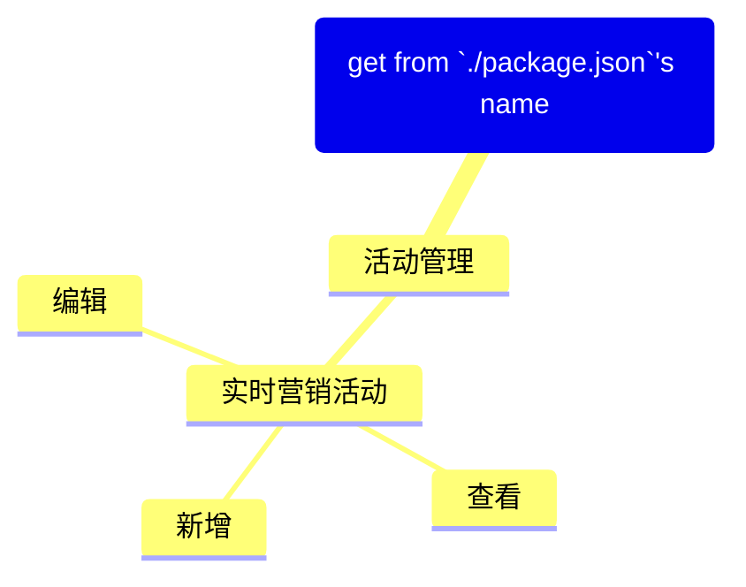

<task name="Generate Pages & Menus Overview">

<task_objective>
此工作流用于根据当前前端工程生成页面与菜单的概览文档。工作流首先使用 `@bud-fe/docs-gen-cli` 扫描 `src/pages` 目录，生成包含页面信息的 Markdown 文件，然后解析用户指定的菜单配置文件以生成 Mermaid 思维导图，并将两者整合到一个 Markdown 文件中。不需要 MCP 服务器，输出格式为 Markdown 文件。
</task_objective>

<detailed_sequence_steps>

# Generate Pages & Menus Overview Process - Detailed Sequence of Steps

## 1. 扫描页面文件

1. 使用 `execute_command` 工具执行 `@bud-fe/docs-gen-cli` 这个包提供的 node 脚本，此脚本会扫描指定目录下的所有 `.tsx` 文件，解析文件顶部约定的注释内容并在指定目录下生成文档：

   ```xml
   <execute_command>
   <command>npx @bud-fe/docs-gen-cli gen-doc src/pages ./memory-bank/pages-menus-overview.md</command>
   <requires_approval>false</requires_approval>
   </execute_command>
   ```

2. 执行成功后，在 `./memory-bank/` 目录下会创建一个名为 `pages-menus-overview.md` 的初始文件，其中包含页面概览表格。

## 2. 解析菜单配置

1. 使用 `ask_followup_question` 工具询问用户菜单配置文件的路径：

   ```xml
   <ask_followup_question>
   <question>请输入菜单配置文件的路径（约定以 `asideMenuConfig` 变量导出）：</question>
   <follow_up>
   <options>["src/menuConfig.tsx", "src/layouts/basic-layout/menuConfig.ts", "其他自定义路径", "忽略"]</options>
   </follow_up>
   </ask_followup_question>
   ```

2. 使用 `read_file` 工具读取指定的菜单配置文件。

3. 在文件内容中查找导出的 `asideMenuConfig` 变量（团队内部约定的变量名）。

4. 解析 `asideMenuConfig` 的结构，生成 Mermaid 格式的思维导图内容。

5. 将生成的思维导图内容插入到 `./memory-bank/pages-menus-overview.md` 文件的头部：
   - 插入 `## Menus Overview` 标题
   - 插入 `_基于 <文件路径> 生成_` 的描述
   - 插入 Mermaid 思维导图代码块，根结点 `root` 的名字从 `./package.json` 中获取

**示例思维导图内容：**



## 3. 整体检查生成的文件

1. 使用 `read_file` 工具读取完整的 `./memory-bank/pages-menus-overview.md` 文件内容。

2. 检查文件内容：

   - 验证 Markdown 语法是否正确
   - 确认思维导图格式无误
   - 确保页面表格完整且格式正确

3. 如果发现任何问题，使用 `apply_diff` 或 `write_to_file` 工具进行修复。

4. 使用 `attempt_completion` 工具向用户展示最终生成的文档文件。

</detailed_sequence_steps>

</task>
