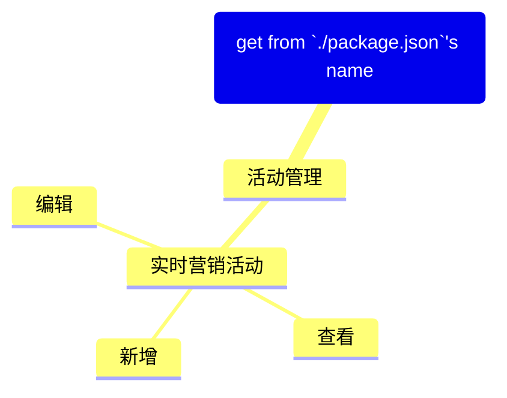

根据当前前端工程生成页面与菜单的概览文档。首先使用 `@bud-fe/docs-gen-cli` 扫描 `src/pages` 目录，生成包含页面信息的 Markdown 文件，然后解析用户指定的菜单配置文件以生成 Mermaid 思维导图，并将两者整合到一个 Markdown 文件中。

## 1. 扫描页面文件

1. 执行 `@bud-fe/docs-gen-cli` 这个包提供的 node 脚本，此脚本会扫描指定目录下的所有 `.tsx` 文件，解析文件顶部约定的注释内容并在指定目录下生成 Markdown 文档：

   ```bash
   npx @bud-fe/docs-gen-cli gen-doc src/pages ./memory-bank/pages-menus-overview.md
   ```

2. 执行成功后，在 `./memory-bank/` 目录下会创建一个名为 `pages-menus-overview.md` 的初始文件，其中包含页面概览表格。

## 2. 解析菜单配置

1. 询问用户项目的菜单配置文件的路径：
   - 选项 1：`src/menuConfig.tsx`【for ice.js 3】
   - 选项 2：`src/layouts/basic-layout/menuConfig.ts`【for ice.js 2】
   - 选项 3: 其他自定义路径
   - 选项 4: 忽略

2. 读取指定的菜单配置文件，在文件内容中查找导出的 `asideMenuConfig` 变量（团队内部约定的变量名）。

3. 解析 `asideMenuConfig` 的结构，生成 Mermaid 格式的思维导图内容。

4. 将生成的思维导图内容插入到 `./memory-bank/pages-menus-overview.md` 文件的头部：
   - 插入 `## Menus Overview` 标题
   - 插入 `_基于 <文件路径> 生成_` 的描述
   - 插入 Mermaid 思维导图代码块，根结点 `root` 的名字从 `./package.json` 中获取

**示例思维导图内容：**



## 3. 整体检查生成的文件

1. 读取完整的 `./memory-bank/pages-menus-overview.md` 文件内容。

2. 检查文件内容：
   - 验证 Markdown 语法是否正确
   - 确认思维导图格式无误
   - 确保页面表格完整且格式正确

3. 如果发现任何问题，提示用户并进行修复。

4. 向用户展示最终生成的文档文件。
